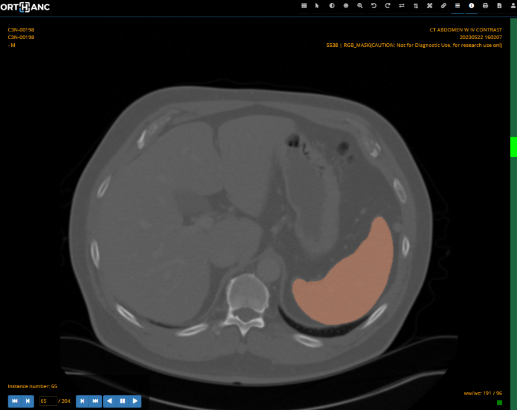

# **mercure-monaisegment**
MONAI Segment is a mercure module for rapid deployment of segmentation models hosted in the MONAI [model zoo](https://monai.io/model-zoo.html). 
 

This module is available as a docker image that can be added to an existing mercure installation using docker tag : *mercureimaging/mercure-monaisegment*. It will perform segmentation of the spleen in CT images using the [Spleen ct segmentation](https://github.com/Project-MONAI/model-zoo/releases/download/hosting_storage_v1/spleen_ct_segmentation_v0.3.8.zip) MONAI bundle. The code was adapted from the [MONAI Deploy bundle app tutorial.](https://docs.monai.io/projects/monai-deploy-app-sdk/en/latest/notebooks/tutorials/06_monai_bundle_app.html)
 

The code can be simply modified to rapidly deploy other segmentation models in the MONAI model zoo.

 

# Installation

## Add module to existing mercure installation
Follow instructions on [mercure website](https://mercure-imaging.org) on how to add a new module. Use the docker tag *mercureimaging/mercure-monaisegment*.

 

## Install new mercure test environment and deploy module
Install [virtual box](https://www.virtualbox.org/) and [vagrant](https://www.vagrantup.com/) and follow jupyter notebook tutorial [*tutorial_mercure-MonaiSegment.ipynb*](./tutorial_mercure-MonaiSegment.ipynb) (less than 1hr to complete).

 

## Build module for local testing, modification and development
1. Clone repo.
2. Build Docker container locally by running make (modify makefile with new docker tag as needed).
3. Test container :\
`docker run -it -v /input_data:/input -v /output_data:/output --env MERCURE_IN_DIR=/input  --env MERCURE_OUT_DIR=/output *docker-tag*`

 

# Output
Segmentations are written to specified output directory in the following formats :
- DICOM SEG
- DICOM RGB masks (segmentations overlaid on background images)

 
 

 
 

### Notes
- Default model 'spleen_ct_segmentation' bundle included in Dockerfile settings.
- To select a different model, set MONAI_BUNDLE_URL to MONAI Model Zoo bundle link address.
- Current requirements:
    * MONAI bundle must support torchscript i.e. include model.ts file
    * MONAI bundle must conform to spec. 
    * MONAI bundle must contain a segmentation model
    * May require further preprocessing or transform operators prior to inference to function correctly.

